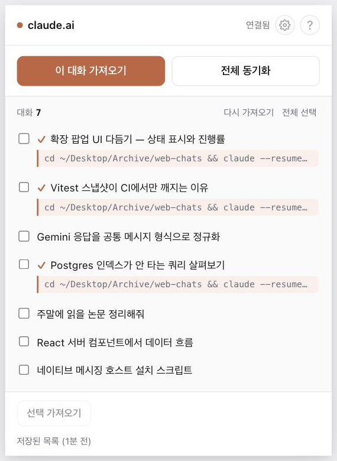
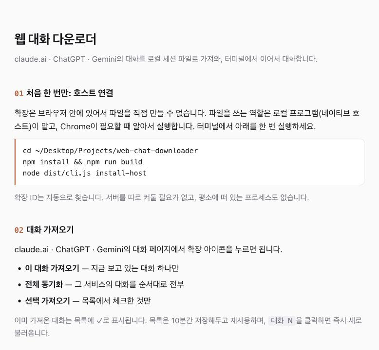
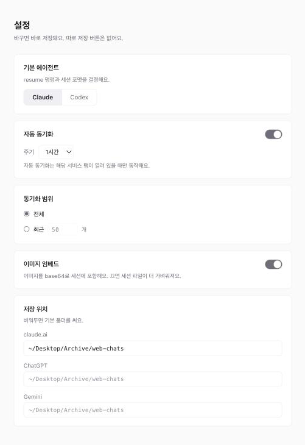

<p align="center">
  
</p>

<p align="center">
  Bring your <b>claude.ai · ChatGPT · Gemini</b> conversations to your own machine<br>
  and continue them in the terminal with <code>claude</code> or <code>codex</code>.
</p>

<p align="center">
  <a href="./LICENSE"></a>
  
  
</p>

<p align="center">
  <a href="./README.md">한국어</a> · <b>English</b>
</p>

---

## The problem

You have a long conversation in the browser, and you want to keep going with it in code. But the chat is stuck in the browser. Copy-pasting loses the context.

This tool moves that conversation into a **local session file**, so you can pick it up in your terminal exactly where you left off.

```bash
cd ~/web-chats
claude --resume <session-id>
# your browser conversation continues here
```

## What it does

- **Three services** — claude.ai · ChatGPT · Gemini
- **One or all** — grab a single conversation, or sync everything in your account
- **Two agents** — saves as a Claude Code or Codex session (your choice in settings)
- **Safe to re-import** — the same conversation updates in place instead of piling up
- **Images included** — inline images go into the session; other files are saved alongside
- **No server** — nothing to keep running in the background

## How it works

A browser extension can read your logged-in conversations but **cannot write files**. A small local program does the writing — and you don't have to keep it running, because **Chrome launches it only when needed** and it exits when done.

```
click the extension on a chat page
   ↓  reads the conversation with your logged-in session
   ↓  Chrome briefly launches the local host and hands it over
   ↓  written out as a session file
~/.claude/projects/<folder>/<session-id>.jsonl
```

No always-on server, no certificates, no CORS setup.

## Requirements

| | |
|---|---|
| **OS** | **macOS** — Native Messaging host installation currently supports macOS paths only. Windows and Linux are not supported yet. |
| **Node.js** | 20 or later |
| **Browser** | Google Chrome |

## Getting started

**1. Clone and build**

```bash
git clone https://github.com/chang-in/web-chat-downloader.git
cd web-chat-downloader
npm install && npm run build
```

**2. Load the extension**

`chrome://extensions` → turn on **Developer mode** → **Load unpacked** → pick the `extension/` folder in this repo

**3. Connect the host** (once)

```bash
node dist/cli.js install-host
```

The extension ID is detected automatically. That's it.

## Using it

Open a **conversation page** on claude.ai · ChatGPT · Gemini and click the extension icon.

<p align="center">
  
</p>

| Button | What it does |
|---|---|
| Import this chat | just the conversation you're looking at |
| Sync all | every conversation on that service, in order |
| Import selected | only the ones you check |

Each imported conversation shows **the exact command to run** underneath. Click it to copy, then paste into your terminal. Already-imported conversations are marked with ✓, and the extension icon shows sync progress (`✓` when done, `!` if something failed).

For details, open the **?** button at the top right of the popup.

<p align="center">
  
</p>

## Settings

Open the **⚙** button in the popup.

<p align="center">
  
</p>

- **Language** — Auto (follows your browser), 한국어, or English
- **Default agent** — save as Claude Code or Codex format
- **Storage path** — split by service if you like (keeps your resume list tidy)
- **Auto sync** — every 30 minutes / 1 hour / 3 hours (runs only while a tab for that service is open)
- **Sync scope** — everything, or just the most recent N
- **Embed images** — turn off for lighter session files

## Good to know

- This uses each service's **undocumented internal API**. If a service changes, things may break.
- Requests go out **one at a time**. With a lot of conversations a service may still rate-limit you — the extension **stops immediately** and keeps what it already fetched. Try again in a minute or two.
- **The web is the source of truth.** If you continue a conversation on the web and re-import, it updates to the latest — but anything you added locally via `--resume` may be overwritten.
- This is for pulling **your own conversations onto your own machine**. Nothing is sent anywhere else.

## Troubleshooting

**`Cannot find module '.../dist/cli.js'`**
You ran it outside the repository. Move to the folder that contains `dist/` and run it again.

```bash
cd <repo folder>
node dist/cli.js install-host
```

If there's no `dist/` at all, you haven't built yet — run `npm install && npm run build` first.

**Clicking the extension does nothing**
Make sure you're on a **conversation page** of claude.ai · ChatGPT · Gemini. It doesn't work on list pages.

**"Host not found"**
Reloading the extension **changes its ID**. When that happens, connect the host again.

```bash
node dist/cli.js install-host
```

**Connected, but still not working**
Check that the manifest was written, then quit Chrome completely and reopen it — Chrome reads the manifest at startup.

```bash
cat ~/Library/Application\ Support/Google/Chrome/NativeMessagingHosts/com.web_chat_downloader.host.json
```

**Sync stopped halfway**
The service rate-limited you. **Whatever was fetched is kept.** Run it again in a minute or two and it picks up where it stopped.

## Uninstalling

```bash
rm -rf ~/.web-chat-downloader
rm ~/Library/Application\ Support/Google/Chrome/NativeMessagingHosts/com.web_chat_downloader.host.json
```

Then remove the extension from `chrome://extensions`. **Sessions you already downloaded are not deleted.**

## Development

```bash
npm test           # vitest
npx tsc --noEmit   # type check
```

| Path | Role |
|---|---|
| `src/adapters/` | normalizes each service's response into a shared shape |
| `src/core/` | writes session files (Claude · Codex), stores attachments, prevents duplicates |
| `src/native-host.ts` | the host that talks to the extension over stdin/stdout |
| `extension/` | Chrome extension (popup · settings · background · content scripts) |
| `extension/_locales/` | UI strings (`ko`, `en`) |

See [CONTRIBUTING.md](./CONTRIBUTING.md). Small fixes are welcome.

## License

[MIT](./LICENSE) — use it, change it, redistribute it.
