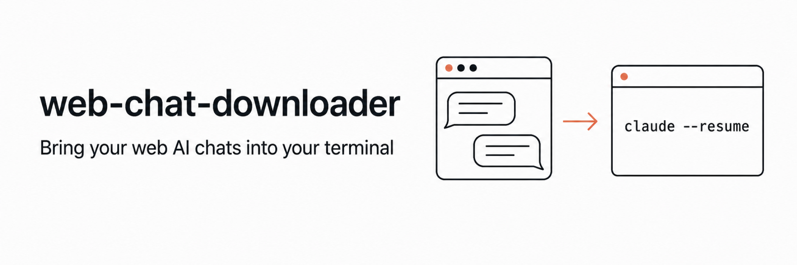

<p align="center">
  
</p>

<p align="center">
  claude.ai · ChatGPT · Gemini에서 하던 대화를 <b>내 컴퓨터로 가져와</b><br>
  터미널에서 <code>claude</code>나 <code>codex</code>로 이어서 대화할 수 있습니다.
</p>

<p align="center">
  <a href="./LICENSE"></a>
  
  
</p>

---

## 이런 적 있으신가요

웹에서 한참 대화하다가 "이거 코드로 옮겨서 계속하고 싶은데" 싶을 때가 있습니다.
그런데 브라우저의 대화는 브라우저에 갇혀 있죠. 복사해서 붙여넣으면 맥락이 끊기고요.

이 도구는 그 대화를 **로컬 세션 파일로 그대로 옮겨서**, 터미널에서 하던 얘기를 이어가게 해줍니다.

```bash
cd ~/Desktop/Archive/web-chats
claude --resume <세션 ID>
# 웹에서 하던 대화가 그대로 이어집니다
```

## 무엇을 해주나요

- **세 서비스 지원** — claude.ai · ChatGPT · Gemini
- **한 번에 전부** — 대화 하나만 가져오거나, 계정의 대화를 통째로 동기화
- **두 에이전트** — Claude Code 세션 또는 Codex 세션으로 저장 (설정에서 선택)
- **다시 가져와도 안전** — 같은 대화는 새로 쌓이지 않고 최신 내용으로 갱신됩니다
- **이미지도 함께** — 대화 속 이미지는 세션에 담기고, 첨부 파일은 따로 저장됩니다
- **서버가 없습니다** — 뭔가를 켜두고 다닐 필요가 없습니다

## 어떻게 동작하나요

브라우저 확장은 로그인된 상태로 대화를 읽을 수 있지만 **파일을 만들 수는 없습니다**.
파일을 쓰는 일은 로컬 프로그램이 맡는데, 그 프로그램을 계속 띄워둘 필요는 없습니다 —
**Chrome이 필요한 순간에만 실행**하고 끝나면 알아서 종료되기 때문입니다.

```
대화 페이지에서 확장 클릭
   ↓  로그인 세션으로 대화를 읽고
   ↓  Chrome이 로컬 호스트를 잠깐 실행해서 넘기면
   ↓  형식을 맞춰 세션 파일로 저장
~/.claude/projects/<폴더>/<세션 ID>.jsonl
```

덕분에 상시 서버도, 인증서도, CORS 설정도 필요 없습니다.

## 시작하기

**1. 내려받아 빌드합니다**

```bash
git clone https://github.com/chang-in/web-chat-downloader.git
cd web-chat-downloader
npm install && npm run build
```

**2. 확장을 로드합니다**

`chrome://extensions` → 우상단 **개발자 모드** 켜기 → **압축해제된 확장 프로그램을 로드** → 이 저장소의 `extension/` 폴더 선택

**3. 호스트를 연결합니다** (처음 한 번만)

```bash
node dist/cli.js install-host
```

확장 ID는 알아서 찾습니다. 이제 준비가 끝났습니다.

## 써보기

claude.ai · ChatGPT · Gemini의 **대화 페이지**에서 확장 아이콘을 누르면 됩니다.

| 버튼 | 하는 일 |
|---|---|
| 이 대화 가져오기 | 지금 보고 있는 대화 하나 |
| 전체 동기화 | 그 서비스의 대화를 순서대로 전부 |
| 선택 가져오기 | 목록에서 체크한 것만 |

가져온 대화 아래엔 **실행할 명령이 그대로** 보입니다. 누르면 복사되니 터미널에 붙여넣으면 됩니다.
이미 가져온 대화는 ✓로 표시되고, 동기화 중에는 확장 아이콘에 진행률이 뜹니다(끝나면 `✓`, 문제가 있으면 `!`).

자세한 사용법은 팝업 오른쪽 위 **?** 버튼에서 볼 수 있습니다.

## 설정

팝업의 **⚙** 버튼에서 바꿀 수 있습니다.

- **기본 에이전트** — Claude Code / Codex 중 어느 형식으로 저장할지
- **저장 위치** — 서비스별로 폴더를 나눌 수 있습니다 (나누면 재개 목록도 서비스별로 깔끔해집니다)
- **자동 동기화** — 30분 / 1시간 / 3시간 주기 (해당 서비스 탭이 열려 있을 때 동작합니다)
- **동기화 범위** — 전체 또는 최근 N개만
- **이미지 임베드** — 끄면 세션이 가벼워집니다

## 알아두면 좋습니다

- 각 서비스의 **공개되지 않은 내부 API**를 사용합니다. 서비스가 바뀌면 동작하지 않을 수 있습니다.
- 요청은 **하나씩 순서대로** 보냅니다. 그래도 대화가 아주 많으면 서비스가 잠시 제한할 수 있는데,
  그럴 땐 확장이 **즉시 멈추고** 받은 데이터는 지킵니다. 1~2분 뒤 다시 열어주세요.
- **웹을 원본으로 봅니다.** 웹에서 대화를 더 이어간 뒤 다시 가져오면 최신 내용으로 갱신되지만,
  로컬에서 `--resume`으로 이어간 내용은 덮일 수 있습니다.
- 이 도구는 **본인 계정의 대화를 본인 컴퓨터로** 내려받는 용도입니다. 외부로 데이터를 보내지 않습니다.

## 개발

```bash
npm test           # vitest
npx tsc --noEmit   # 타입 검사
```

| 경로 | 역할 |
|---|---|
| `src/adapters/` | 서비스별 응답을 공통 형식으로 정규화 |
| `src/core/` | 세션 파일 작성(Claude·Codex), 첨부 저장, 중복 방지 |
| `src/native-host.ts` | 확장과 stdin/stdout으로 주고받는 호스트 |
| `extension/` | Chrome 확장 (팝업·설정·백그라운드·콘텐츠 스크립트) |

기여는 [CONTRIBUTING.md](./CONTRIBUTING.md)를 봐주세요. 작은 수정도 환영합니다.

## 라이선스

[MIT](./LICENSE) — 자유롭게 쓰고, 고치고, 배포하셔도 됩니다.
